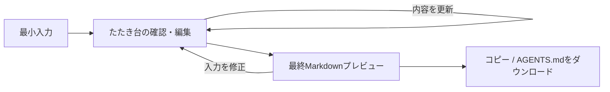

# 段階的なAGENTS.md生成体験の設計

## 結論

初期リリースでは、利用者に最初から詳細な運用情報を入力させない。必須入力をプロジェクト概要だけに絞り、アプリが安全な固定ルールを含むたたき台を表示する。利用者はそのたたき台で必要な情報だけを追加・修正・削除し、確認後に整形済みの `AGENTS.md` を出力する。

この文書は、旧 `docs/question-output-spec.md` の「初回フォームでプロジェクトコマンドを必須入力する」仕様を置き換える。旧仕様を前提とする Issue #5 と PR #21 はクローズ済みである。

## 解決したい課題

- `AGENTS.md` を初めて作る利用者に、コマンドや制約を最初から考えさせない。
- プロジェクト固有の事実と、アプリ側が提供できる共通ルールを区別する。
- 不明なコマンドや固有ルールを事実として捏造しない。
- 最終出力の前に、利用者が内容を理解し、必要な箇所だけを直せるようにする。

## 想定ユーザー

- AIコーディングエージェント向けのルールを初めて整備する開発者。
- プロジェクトの概要は説明できるが、標準的な `AGENTS.md` の構成や運用ルールを一から書きたくない開発者。

## 初期リリース範囲

- ブラウザ内だけで動作する、保存・外部送信をしないWebアプリ。
- プロジェクト概要からの固定テンプレートによるたたき台生成。
- たたき台に含まれる、プロジェクト固有情報と共通ルールの編集。
- 最終Markdownのプレビュー、コピー、`AGENTS.md` ダウンロード。

## 今回作らないこと

- リポジトリ、`package.json`、既存 `AGENTS.md` の自動解析。
- 外部AI APIによる推測・文章生成。
- クラウド保存、ログイン、DB、共有リンク。
- 入力履歴、複数テンプレート、多言語出力。

## 画面と状態遷移

### 1. 最小入力

必須入力はプロジェクト概要だけにする。概要は、対象ユーザー、解決する課題、提供するものを自由記述する。

| 項目 | 必須 | 形式 | 使い道 |
| --- | --- | --- | --- |
| プロジェクト概要 | はい | 複数行テキスト、1〜1,000文字 | 目的セクションのたたき台 |
| 技術スタック | いいえ | 1行1項目、最大20件 | 技術スタックと技術固有ルールの候補 |
| 追加で守ってほしいこと | いいえ | 1行1項目、最大10件 | 制約の候補 |

初回画面に、実行コマンド、プロジェクト名、Git方針などの詳細入力は置かない。これらは次画面で、たたき台を見ながら任意で編集する。

### 2. たたき台の確認・編集

最小入力の送信後、アプリは編集可能なたたき台を表示する。利用者は各項目を追加・修正・削除してから最終生成へ進む。

| 編集項目 | 初期値 | 利用者の操作 | 表示上の扱い |
| --- | --- | --- | --- |
| 文書タイトル | `AGENTS.md` | 任意で変更 | 空の場合は `AGENTS.md` を使用 |
| 導入文 | `このファイルは、このプロジェクトで作業するAIエージェント向けの指示です。` | 編集不可 | アプリの固定テンプレートとして常に出力 |
| プロジェクトの目的 | 初回のプロジェクト概要 | 編集可能 | 必須。空にはできない |
| 技術スタック | 初回入力値 | 追加・修正・削除 | 空ならセクションを出力しない |
| プロジェクトコマンド | 空 | 追加・修正・削除 | 未登録であることを明示し、空ならコマンド一覧を出力しない |
| 追加の制約 | 初回入力値 | 追加・修正・削除 | 共通制約とは別に表示 |
| 共通ルール | 固定テンプレート | 各ルールを編集・削除・追加可能 | アプリが補完した内容であることを示す。必須カテゴリは1件以上必要 |
| 技術固有ルール | 技術スタックからの固定判定 | 編集・削除可能 | 一致しない場合は表示しない |

共通ルールと技術固有ルールには「アプリが補完した内容」の表示を付ける。利用者が編集した後は、その編集内容を最終出力の唯一の根拠とする。

必須セクションである「実装方針とコーディング規約」「テスト・品質確認」「Git・Pull Request運用」「AIエージェントの作業手順」「禁止事項と安全上の制約」は、それぞれ最低1件のルールを必要とする。利用者が最後の1件を削除しようとした場合は、そのカテゴリの削除を受け付けず、追加または内容の編集を案内する。これにより、空の見出しと必須セクションの省略を防ぐ。

### 3. 最終Markdownプレビューと出力

利用者が編集内容を確認して「AGENTS.mdを生成」を選ぶと、最終Markdownをプレビューする。プレビューでは入力画面へ戻れる。コピーとダウンロードは同じ正規化済みMarkdown文字列を利用し、内容の不一致を防ぐ。

## 補完と正確性のルール

### アプリが補完してよい内容

アプリは、プロジェクトの事実を推測せず、以下の固定テンプレートだけを補完する。

- 既存の指示、構成、命名、スタイルを優先する。
- 依頼の目的に必要な最小限の差分にする。
- 入力不足、空状態、想定外の値、処理失敗でクラッシュさせない。
- 関連するテストと品質確認を行い、未実行・失敗は明示する。
- 無関係な変更をcommitへ含めず、履歴の書き換えは明示依頼時だけ行う。
- 秘密情報を出力・commitしない。利用者の未commit変更を上書きしない。
- 作業前に関連する指示、ドキュメント、既存実装、影響範囲を確認する。
- 仕様変更や依頼範囲の拡大が必要なら、実装前に利用者へ確認する。
- 作業後に差分を確認し、利用可能な関連検証を実行する。
- 完了報告には、実施概要、変更ファイル、検証結果、未対応事項または懸念点を含める。

技術スタックが入力された場合だけ、次の明示的な一致語に対応する技術固有ルールを候補として補う。各技術項目へUnicode Normalization Form KC（NFKC）を適用し、小文字へ変換してから、英数字の単語境界または表に記載した複合語の完全一致で判定する。単純な部分一致は使わず、例えば `django` を `go` と判定しない。複数のプロファイルへ一致した場合は表の上から順にすべて候補へ加え、完全に同じルールは重複させない。

| プロファイル | 一致語 | 追加するルール |
| --- | --- | --- |
| TypeScript | `typescript` | 既存のstrict設定を維持し、型エラーを回避するためだけのanyや型アサーションを安易に追加しない。 |
| JavaScript | `javascript`、`node.js`、`nodejs` | 既存のモジュール形式と実行環境を維持し、暗黙の型変換へ依存しない。 |
| React | `react`、`next.js`、`nextjs` | 既存のコンポーネント構成と状態管理方針を維持し、UI変更では基本的なキーボード操作とアクセシビリティを確認する。 |
| Vue | `vue`、`nuxt` | 既存のComposition APIまたはOptions APIの選択と状態管理方針を維持する。 |
| Python | `python`、`django`、`flask`、`fastapi` | 既存のフォーマッター、リンター、型注釈の方針に合わせ、例外を握りつぶさない。 |
| Swift | `swift`、`swiftui`、`uikit` | 既存のデータフローと命名規則を維持し、UI状態の更新箇所を明確にする。 |
| Kotlin | `kotlin` | 既存のnull安全性、非同期処理、UIアーキテクチャの方針を維持する。 |
| Rust | `rust` | 所有権とエラー型を明確にし、回復可能な入力エラーへ安易にpanicやunwrapを使用しない。 |
| Go | `golang`、`go` | gofmtに従い、エラーを明示的に処理し、既存のpackage境界を維持する。 |

どのプロファイルにも一致しない場合、技術固有ルールを推測で追加しない。

一致した技術固有ルールは、編集用たたき台では「実装方針とコーディング規約」の固定ルールの直後に表示する。最終Markdownでも、利用者が確認・編集した同じ順序のまま、そのセクションの固定ルール末尾へ出力する。

### アプリが補完してはいけない内容

- 実在するプロジェクトコマンド。
- 未入力のプロジェクト固有制約、外部サービス、権限、保存方式。
- テストの成否、CIの状態、リポジトリの構成。

コマンド欄は初期状態で空にし、「実行してよいコマンドが分かる場合だけ追加してください」と案内する。ユーザーがコマンドを追加したときだけ、アプリは次の決定的なラベル候補を表示する。判定は英数字の単語境界で行い、複数一致した場合は表の上から最初に一致したラベルを1つだけ使う。未知のコマンドはラベルなしにする。ラベルは編集可能である。

| 一致するコマンド単語 | 用途ラベル |
| --- | --- |
| `install` | 依存関係をインストール |
| `dev` | 開発サーバー |
| `lint` | lint |
| `typecheck` | 型チェック |
| `test` | テスト |
| `build` | build |
| `format` | フォーマット |

## データの境界

| 段階 | データ | 信頼できる根拠 |
| --- | --- | --- |
| 最小入力 | 概要、任意の技術スタック・追加制約 | 利用者入力 |
| たたき台 | 最小入力、固定テンプレート、技術一致ルール | 利用者入力とアプリ内定義 |
| 編集済みたたき台 | 全セクション、コマンド、制約、ルール | 利用者が確認・編集した値 |
| 最終Markdown | 編集済みたたき台を整形した文字列 | 編集済みたたき台のみ |

外部入力や将来の保存値は `unknown` として受け、型・形式が不正な値は空値へ正規化する。初期リリースでは永続保存を実装しない。

## 最終出力の構成と整形規則

出力するセクションと順序は次のとおりとする。任意情報が空のセクションは出力しない。

1. `# 文書タイトル`
2. 導入文
3. `## プロジェクトの目的`
4. `## 技術スタック`（任意）
5. `## プロジェクトコマンド`（任意）
6. `## 実装方針とコーディング規約`
7. `## テスト・品質確認`
8. `## Git・Pull Request運用`
9. `## AIエージェントの作業手順`
10. `## 禁止事項と安全上の制約`

- 見出し、段落、リストの間には空行を1行だけ置く。
- 箇条書きは `- ` を使う。
- 利用者が編集した通常テキスト（タイトル、目的、技術スタック、追加制約、コマンド用途ラベル）は、Markdownとして解釈しない。正規化後、バックスラッシュを先に `\\` へエスケープし、その後 `` ` ~ = * _ { } [ ] ( ) < > # + - . ! | `` の各文字の直前へ `\` を付ける。複数行の目的は行ごとにこの処理を行い、改行を維持する。アプリの固定文言とコマンド本文はこの通常テキストのエスケープ対象外とする。
- コマンドはインラインコードとして出力し、必要に応じて編集済みの用途ラベルを先頭へ付ける。区切りには、コマンド値内の最長の連続バッククォートより1個長いバッククォート列を使い、区切りの内側へ半角スペースを1つ置く。
- 「追加で守ってほしいこと」は、編集済みの入力順を保ったまま「禁止事項と安全上の制約」の固定ルールの末尾へ追加する。空の場合は追加しない。
- CRLF、末尾空白、3行以上の連続改行を残さず、末尾はLFを1つだけにする。

## 後続実装Issueの分割案

| 順序 | 作業 | 依存 | 主な変更範囲 |
| --- | --- | --- | --- |
| 1 | [#23 段階的生成用の質問・編集データモデル](https://github.com/mytysoldier/agents-md-generator/issues/23) | #22 | 型、正規化、質問・編集設定、ユニットテスト |
| 2 | [#24 たたき台作成と最終Markdown整形ロジック](https://github.com/mytysoldier/agents-md-generator/issues/24) | #23 | 純粋関数、固定テンプレート、単体テスト |
| 3 | [#25 最小入力とたたき台編集UI](https://github.com/mytysoldier/agents-md-generator/issues/25) | #23、#24 | React UI、入力・編集フロー、UIテスト |
| 4 | [#26 最終プレビュー、コピー、ダウンロード](https://github.com/mytysoldier/agents-md-generator/issues/26) | #24、#25 | React UI、Clipboard、Blob、UIテスト |
| 5 | [#27 バリデーション、例外状態、アクセシビリティ](https://github.com/mytysoldier/agents-md-generator/issues/27) | #25、#26 | 横断的なUI調整とテスト |

データモデルと生成ロジックを先行して直列に完了させる。編集UIと最終出力UIは共有状態・画面構造を扱うため、原則直列に対応する。

## 受け入れ条件との照合

| Issue #22の受け入れ条件 | 充足箇所 |
| --- | --- |
| 画面・状態遷移 | 「画面と状態遷移」 |
| 入力・補完・編集の区別 | 「最小入力」「たたき台の確認・編集」「データの境界」 |
| コマンドと制約を最初の必須入力に含めない | 「最小入力」 |
| 捏造しない確認ルール | 「補完と正確性のルール」 |
| 決定的な整形規則 | 「最終出力の構成と整形規則」 |
| 後続Issueの分割 | 「後続実装Issueの分割案」 |
